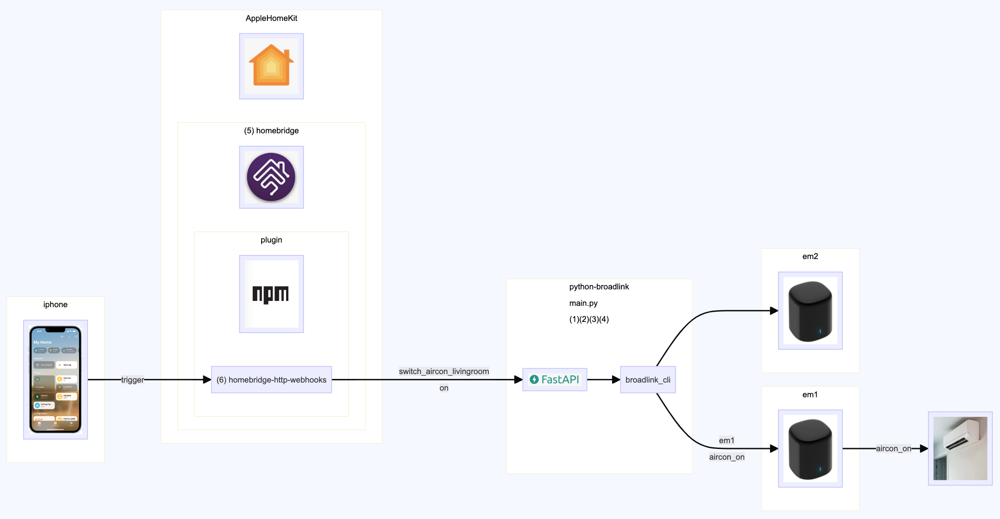

# original repository

```
original 
README_original.md
original
https://github.com/mjg59/python-broadlink
```

<br/>

# about this python-broadlink

- main.py (it's python fastapi, merely restful api in python)
- main.py just providing entry points for homebridge webhook
- how to setup and start this main.py (1)(2)(3)(4)
- how to setup and setart homebridge (5)
- how to setup and setart homebridge http webhook (6)




### (1) root

your linux box should have python3.9 and venv, if not use root to install:

```
# apt install python3.9
# apt install python3.9-venv
```

### (2) user

user account is sufficient to start fastapi in virtual env

```
cd $HOME/venv
/usr/bin/python3.9 -m venv --system-site-packages py39ir
source py39ir/bin/activate
pip3 install --upgrade pip
# imports 
pip3 install pyyaml==6.0
pip3 install --upgrade pyopenssl cryptography
pip3 install broadlink
pip3 install fastapi uvicorn

# from now on you are in 'py39ir' virtual environment
# 以下 (3) (4) 都需要在 'py39ir' 環境下
```

### (3) copy config files

make sure you are in 'py39ir' virtual environment

```
# i host code in 'giblab'
git clone https://gitlab.com/jiechau/python-broadlink
cd python-broadlink
# about file_em_ and file_signal_
cd cli
python broadlink_discovery # write down content in cli/file_em_em1

#
# learn
python broadlink_cli --device @file_em_em1 --learn # the 'Raw:' is cli/file_signal_aircon_on, is the DATA
... then you repeat --learn to learn
# test
$ python broadlink_cli --device @file_em_em1 --send DATA # Send code
$ python broadlink_cli --device @file_em_em1 --send @file_signal_aircon_on # Send code from file

#
# edit yaml file
cp config_secrets_python-broadlink_example.yaml config_secrets_python-broadlink.yaml
# 需要這個 yaml 檔案定義 em 和 signal, 就是 剛剛 --learn 找到的
```

### (4) run (192.168.123.166 is host ip example, i run in 192ubuntu)

```
# start fastapi
uvicorn main:app --host 0.0.0.0 --port 8080
```

```
# test 
# suppose your host ip is 192.168.123.166
GET http://192.168.123.166:8080/ping
```

```
# how it works (restful api)
POST http://192.168.123.166:8080/trigger
{
    "id": "switch_aircon_livingroom",
    "action": "on"
}
```

- what this project (python-broadlink) really do is restful api (main.py) 
- to provide webhook entry for the homebridge 'homebridge-http-webhooks'
- the above trigger api w/ para will actuall call subprocess:

```
python-broadlink/cli/broadlink_cli.sh /file...location/file_em_em1 /file...location/file_signal_aircon_on
```

- let the emission em1 to fire aircon_on signal:

```
python-broadlink/cli/broadlink_cli --device @/file...location/file_em_em1 --send @/file...location/file_signal_aircon_on
```

- em (emission source) and sg (signal) are defined in config_secrets_python-broadlink.yaml
- you could find the emission/signal content in (3)

- misc:
- this main.py actually provides 3 ways (routers) to be called:
- /trigger (call broadlink to fire ir)
- /exec (run a script)
- /telegram (send a telegram message)


<br/>

# Apple Apple HomeKit

### (5) homebridge

- Homebridge https://github.com/homebridge 
- Homebridge Docker image https://github.com/homebridge/docker-homebridge

```
# i use docker, _NO_ docker compose
# this way you backup all your setting in $(pwd)/homebridge
docker run --net=host --name=homebridge -v $(pwd)/homebridge:/homebridge homebridge/homebridge:latest
```

- once you have your homebridge set up and running, you could access port 8581

```
http://<homebridge ip>:8581/
# in my case:
http://192.168.123.164:8581/
```

- use web UI to add plugins (recommend):
- these 2 function the same, just one is cmd shell and another is http web api
    * homebridge-cmdswitch2
    * homebridge-http-webhooks
- i use 'homebridge-http-webhooks' https://www.npmjs.com/package/homebridge-http-webhooks

- or alternatively add plugins by command line (not recommend):
```
hb-service add homebridge-cmdswitch2
hb-service add homebridge-http-webhooks
```


### (6) homebridge-http-webhooks


- i use "homebridge-http-webhooks" 
- visit for config examples (different device) https://www.npmjs.com/package/homebridge-http-webhooks
- config setting for devices and config

```
http://<homebridge ip>:8581/config
# in my case:
http://192.168.123.164:8581/config
```

- example in config.json:
- in this example, 'http://192.168.123.166:8080/trigger' is what this repos (main.py) provided
- on_body and on_headers is the payload

```
{
    "bridge": {
        "name": "Homebridge xxxx",
        "username": "0E:87:92:xx:xx:xx",
        "port": 51056,
        "pin": "111-11-11",
        "advertiser": "bonjour-hap"
    },
    "accessories": [],
    "platforms": [
        {
            "platform": "HttpWebHooks",
            "webhook_port": "51828",
            "switches": [
                {
                    "id": "switch_aircon_livingroom",
                    "name": "客廳冷氣",
                    "on_url": "http://192.168.123.166:8080/trigger",
                    "on_method": "POST",
                    "on_body": "{ \"id\": \"switch_aircon_livingroom\", \"action\": \"on\" }",
                    "on_headers": "{\"Content-Type\": \"application/json\"}",
                    "off_url": "http://192.168.123.166:8080/trigger",
                    "off_method": "POST",
                    "off_body": "{ \"id\": \"switch_aircon_livingroom\", \"action\": \"off\" }",
                    "off_headers": "{\"Content-Type\": \"application/json\"}"
                }
            ]
        },
        {
            "name": "Config",
            "port": 8581,
            "platform": "config"
        }
    ]
}
```


